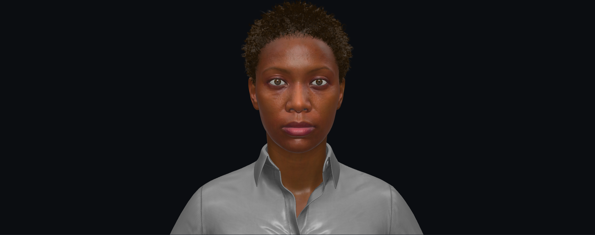

# MetaHuman → GLB

<p align="center">
  <a href="https://smorchj.github.io/metahuman-to-glb/">
    
  </a>
</p>

<p align="center">
  <a href="https://smorchj.github.io/metahuman-to-glb/">
    
  </a>
</p>

Five-stage pipeline that exports a UE 5.7 MetaHuman to a web-ready GLB with all 51 ARKit blendshapes, then deploys it as a three.js viewer on GitHub Pages.

## Live demo

**https://smorchj.github.io/metahuman-to-glb/**

## Pipeline

```
"export /Game/Foo/MHC_Foo"
   |
   00: UE assemble                         (~1-2 min)
   01: UE Sequencer ARKit bake + GLB       (~1-2 min)
   02: Blender: ARKit shape keys + groom   (~60-90 s)
   03: Blender: Draco-compressed GLB       (~30-60 s)
   04: three.js viewer build               (~5 s)
   |
   docs/characters/<id>/<id>.glb            (~40 MB, 51 ARKit blendshapes)
```

Each stage is a Python or PowerShell script run by a Claude sub-agent. The agent reads only that stage's `CONTEXT.md` and the character manifest, runs the script, and updates its own status block. Nothing shares state across stages.

## ARKit blendshapes

UE's GLTFExporter strips morph names and outputs ~700 MB when you request the full 858 RigLogic morphs. `AnimSequence.get_anim_pose_at_frame()` returns curve inputs, not resolved bone transforms. RigLogic Python bindings aren't shipped (see [EpicGames/MetaHuman-DNA-Calibration #43](https://github.com/EpicGames/MetaHuman-DNA-Calibration/issues/43)).

The approach that works: build a transient Level Sequence with `AS_MetaHuman_ARKit_Mapping` at 24fps (one integer frame per ARKit pose), call `SequencerTools.export_level_sequence_fbx()`. Sequencer runs RigLogic + correctives natively and outputs an FBX with per-frame bone keyframes. Stage 02 replays that in Blender, scrubs to each frame, captures the deformed mesh via `evaluated_get(depsgraph)`, and transfers shape keys to the GLB face mesh by KDTree position match. Eyebrow, mustache, and beard card meshes get the same shapes propagated via k=4 inverse-distance-squared weighting.

## Setup

1. Clone the repo.
2. Copy the config template and fill in your local paths:
   ```
   cp _config/pipeline.example.yaml _config/pipeline.yaml
   ```
   Required: `.uproject` path, `UnrealEditor-Cmd.exe`, `blender.exe` (5.x).
3. Have your MetaHumanCharacter in the UE project under `/Game/<Name>/`.

`_config/pipeline.yaml` is gitignored.

## Usage

In Claude Code:

```
export /Game/Ada/MHC_Ada
```

To run a single stage directly:

```powershell
./5.7/facescan-glb/stages/00-unreal-assemble/tools/run_assemble.ps1 -Char ada
./5.7/facescan-glb/stages/01-unreal-glb-export/tools/run_export.ps1   -Char ada
./5.7/facescan-glb/stages/02-blender-assemble/tools/run_assemble.ps1  -Char ada
./5.7/facescan-glb/stages/03-export-to-glb/tools/run_export.ps1       -Char ada
./5.7/facescan-glb/stages/04-webview-build/tools/run_site.ps1         -Char ada
```

## Layout

```
5.7/facescan-glb/
  RUN.md                          orchestrator entry point
  tools/bootstrap_character.py   scaffolds characters/<id>/
  stages/
    00-unreal-assemble/
      CONTEXT.md                  stage contract
      tools/run_assemble.ps1
    01-unreal-glb-export/
    02-blender-assemble/
    03-export-to-glb/
    04-webview-build/
  characters/
    _template/
    <id>/manifest.json            per-stage status
  docs/characters/<id>/<id>.glb   published viewer output
```

## Status

Running with **Sander** (FaceScan→MetaHuman), plus **Bo**/**Bruce** test
characters. Tested in Safari on iPhone X. (Fork of `metahuman-to-glb`; the
cinematic pipelines and other characters live in the upstream repo.)

What the 5.7 pipeline produces:

- 51 ARKit blendshapes (`tongueOut` needs a non-default rig variant)
- Correct deformation magnitudes (jawOpen ~33mm, eyeBlinkLeft ~16mm, etc.)
- Facial hair card meshes follow face blendshapes via IDW propagation
- Hair rendering: alpha-to-coverage primary, two-pass blend fallback. Per-strand root darkening and tint variance from atlas channels. Anisotropic specular along strand tangent. Per-character and per-material mode/colour/density overrides.
- Texture cap 1024px, Draco compression, ~40 MB output
- MediaPipe FaceLandmarker live face capture in the viewer

Known gaps:

- Eyelash textures look low-res. The 1024px downsample cap may be hurting coverage textures ([#13](https://github.com/smorchj/metahuman-to-glb/issues/13)).
- Eye occlusion mesh has no alpha mask. Currently renders as a flat 40% dark layer over the whole eye ([#19](https://github.com/smorchj/metahuman-to-glb/issues/19)).
- No scalp darkening under hair cards ([#15](https://github.com/smorchj/metahuman-to-glb/issues/15)).
- `browInnerUp` is a single bilateral blendshape. Left/right asymmetry is lost ([#17](https://github.com/smorchj/metahuman-to-glb/issues/17), [#18](https://github.com/smorchj/metahuman-to-glb/issues/18)).
- FBX bake captures bone deformation only. Fine morph correctives (lip squash, wrinkle deltas) are lost (~5-10mm).
- Clothing base colour is wrong. Mask-blended `diffuse_color_1/2` not wired through ([#12](https://github.com/smorchj/metahuman-to-glb/issues/12)).

## Legacy

The 5.6 cinematic pipeline (`5.6/cinematic/`) used a precomputed NPZ to transplant ARKit shapes. Still works for Ada and Taro but is no longer the recommended path. The 5.7 pipeline derives ARKit deformation natively.

`5.7/cinematic/` exists but is unfinished.

## Contributing

MIT license. PRs welcome. File an issue before larger architectural changes.

Rules worth keeping:

- `5.7/facescan-glb/` does not import from `5.6/cinematic/`.
- A stage agent reads and writes only its own manifest block.
- Deterministic work goes in scripts. Models call scripts and verify outputs.

## License

MIT. See [LICENSE](LICENSE).
